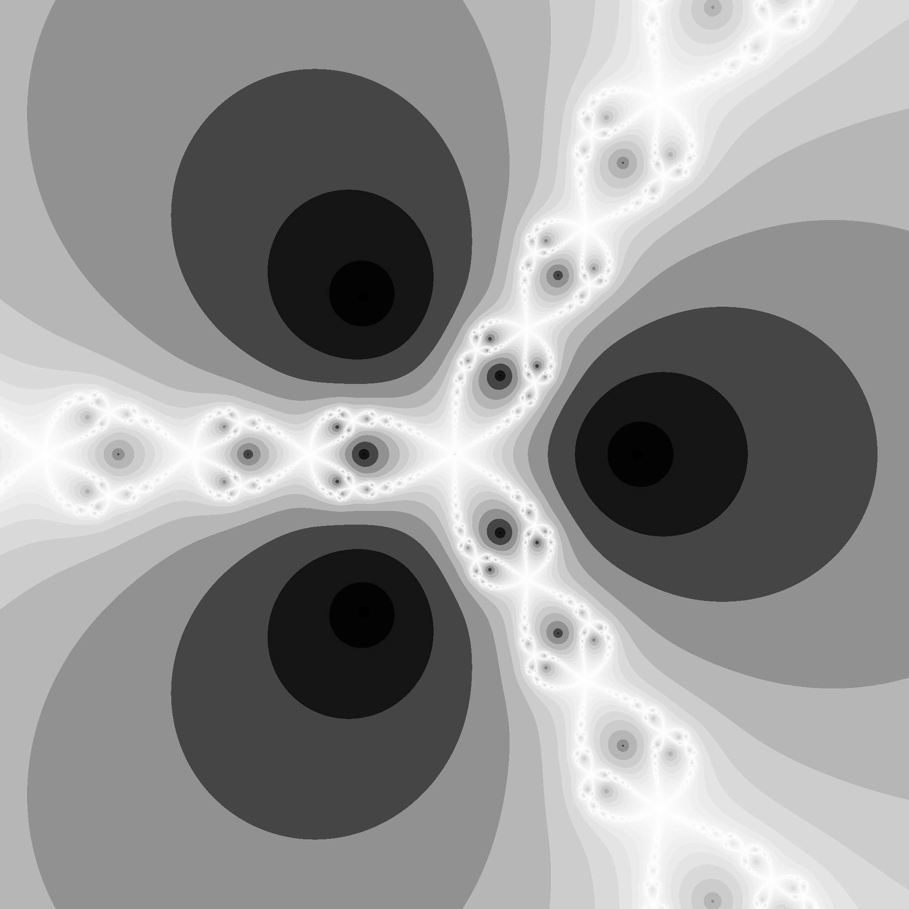

# HIP Newton
GPU Implementation of Newton Fractal Generator with Benchmarking using [AMD HIP SDK](https://github.com/ROCm-Developer-Tools/HIP).

Computes for the Newton fractal in the complex plane bounded by the rectangular corners (-2.5, -2.5) to (2.5, 2.5).

## Usage
```cmd
To use:

[Command Prompt] HIPNewton.exe [WIDTH] [HEIGHT]

or

[Command Prompt] HIPNewton.exe [N]
```

## Sample Run
```cmd
Device: AMD Radeon RX 7800 XT

Estimated GPU RAM requirements: 4294967296 bytes
Total GPU RAM: 17163091968 bytes
Program GPU RAM limit: 8589934592 bytes
Size of int: 4 bytes

generating newton set using GPU ...
GPU elapsed time: 1442.35 ms
generating newton set using CPU ...
CPU elapsed time: 51463.9 ms

35.6807x speedup, diff: 2
```

### Sample output (converted from PGM and PPM to PNG)

#### RGB (2048 x 2048)


#### Gray (2048 x 2048)


## To Do
- Benchmarks
- PNG Image Output
- User defined parameters
- Implement other fractal generators
